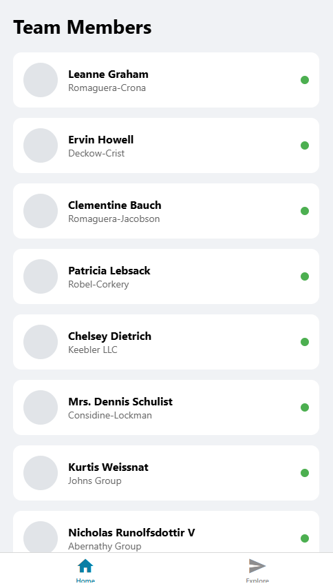

# ReactNativeDemoApp

A modern React Native demo application built with Expo, featuring tab-based navigation, theming, and clean architecture patterns.

## Features

- **React Native with Expo**: Cross-platform mobile development with Expo
- **Expo Router**: File-based routing with tab navigation
- **TypeScript**: Type-safe development experience
- **Theming System**: Centralized theme configuration for consistent styling
- **Tab Navigation**: Built-in tab navigation using Expo Router
- **Modern UI**: Clean and intuitive user interface
- **Platform Support**: iOS and Android support

## Requirements

- Node.js 18.x or later
- npm or yarn
- Expo CLI
- For iOS development: macOS with Xcode
- For Android development: Android Studio

## Installation

1. Clone the repository:
   ```bash
   git clone git@github.com:AnupapPiya/ReactNativeDemoApp.git
   cd ReactNativeDemoApp
   ```

2. Install dependencies:
   ```bash
   npm install
   # or
   yarn install
   ```

3. Start the development server:
   ```bash
   npx expo start
   # or
   npm start
   ```

## Usage

1. After starting the development server, you can:
   - Press `i` to open in iOS simulator
   - Press `a` to open in Android emulator
   - Scan the QR code with Expo Go app on your physical device

2. Navigate through the app using the tab navigation at the bottom.

3. The app demonstrates various React Native features and patterns.

## Project Structure

```
ReactNativeDemoApp/
├── app/                    # Expo Router app directory
│   ├── (tabs)/            # Tab navigation group
│   │   └── index.tsx      # Home/Index tab screen
│   └── detail.tsx         # Detail screen
├── constants/             # App constants
│   └── theme.ts          # Theme configuration
└── ...
```

## Architecture

The app follows a clean and organized structure:

- **App Directory**: `app/` contains screens and navigation structure using Expo Router
- **Constants**: `constants/` contains shared constants and configuration (e.g., theme)
- **Components**: Reusable UI components
- **Navigation**: File-based routing with Expo Router

## Development

### Running on iOS Simulator
```bash
npm run ios
```

### Running on Android Emulator
```bash
npm run android
```

### Building for Production

#### iOS
```bash
npm run build:ios
```

#### Android
```bash
npm run build:android
```

## Screenshots

| Home Screen |
| --- |
|  |

## License

This project is open source and available under the MIT License.
